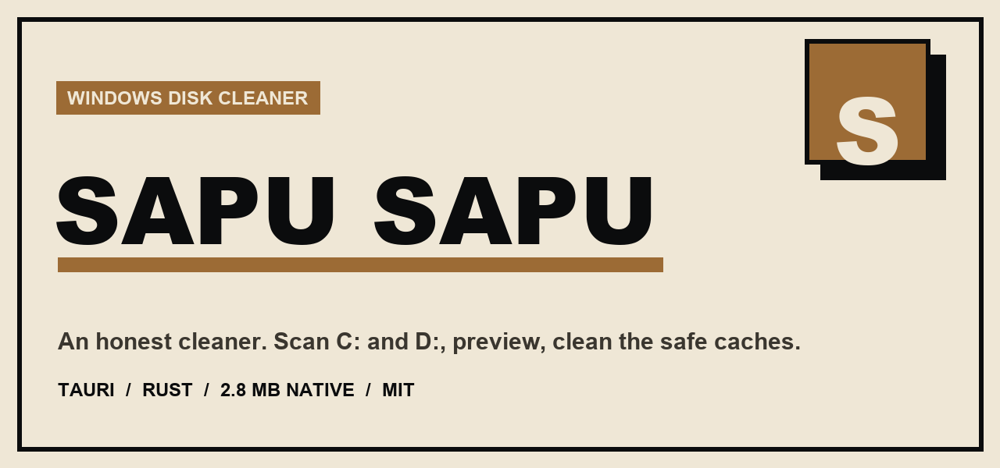
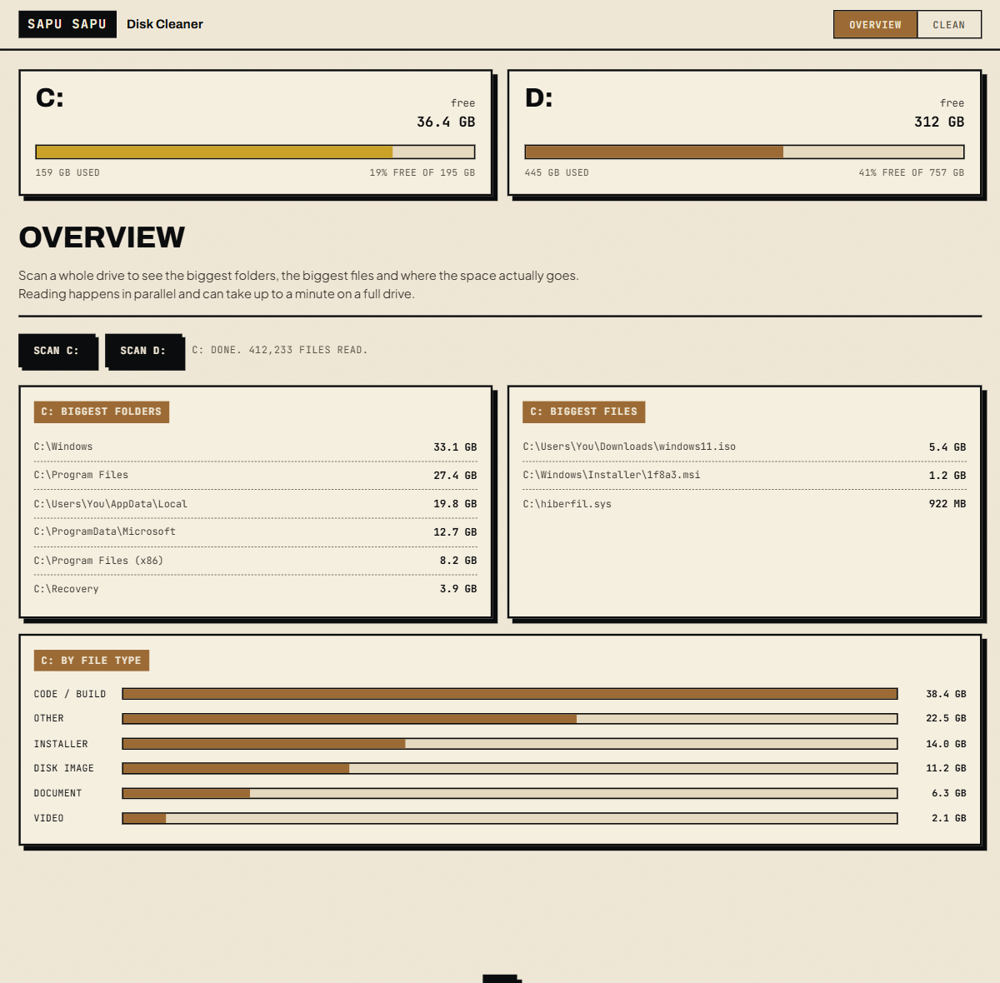
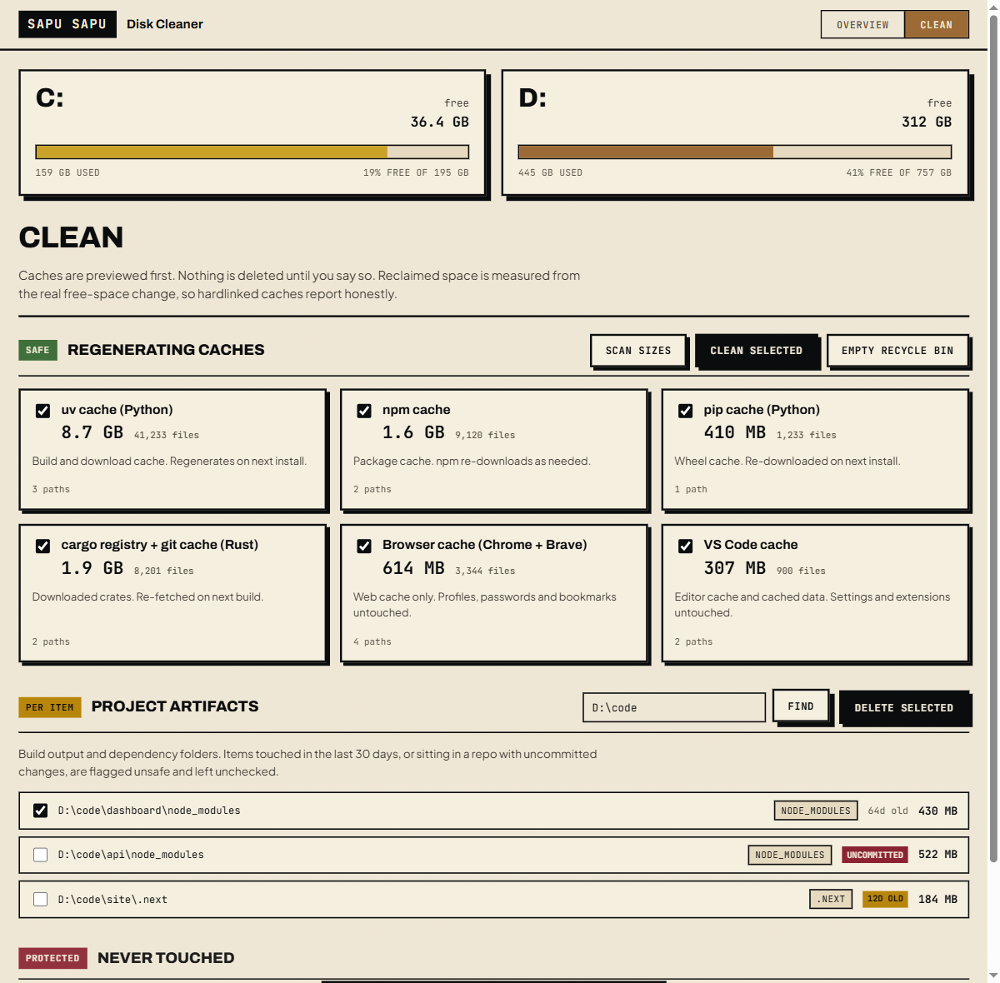

# Sapu Sapu

**A small, honest disk cleaner for Windows. Neo-brutalist on the outside, careful on the inside.**

[](LICENSE)
[](CHANGELOG.md)
[](#install)
[](#tech)
[](#bahasa-indonesia)

Named after the sapu-sapu, the janitor fish that keeps the tank glass clear. Sapu Sapu scans `C:` and `D:` like a space analyzer, surfaces the biggest folders, files and developer caches, and cleans the safe ones. Every clean is previewed first, and reclaimed space is measured from the real free-space change rather than logical folder sizes, so hardlinked caches report the truth.

It is a single native executable of 2.8 MB, built with Tauri 2 (Rust plus the system WebView2). No Electron, no bundled browser, no admin rights.

## What is inside

- **A disk overview** that scans a whole drive and reports the biggest folders, the biggest files, and a breakdown by file type, for both `C:` and `D:`.
- **A risk-tiered cleaner** that previews sizes first, then clears the caches you select.
- **A protected-path guard**, enforced in Rust, that refuses to delete anything that matters.



## Install

Download `Sapu-Sapu.exe` from the [latest release](https://github.com/dharmawan-id/sapu-sapu/releases/latest) and run it. It needs the WebView2 runtime, which ships with current Windows 10 and 11. There is nothing to set up.

## How to use it

1. **Overview.** Open the app, press `Scan C:` or `Scan D:`. After the parallel scan you get the biggest folders, the biggest files, and a breakdown by file type.
2. **Clean.** Switch to the Clean tab, press `Scan sizes`. Each cache shows its size and file count. Tick the ones you want and press `Clean selected`. The freed total is the real free-space change.
3. **Project artifacts.** Point it at a folder (it defaults to `D:\Kerja`) and press `Find`. Build and dependency folders are listed with their age and git status. Recent or uncommitted ones are flagged unsafe and left unchecked.

## Safety

| Tier | What | Default |
|------|------|---------|
| Green | Regenerating caches (uv, npm, pip, cargo, browser, HuggingFace, VS Code, Temp) | Previewed, then deleted on confirm |
| Yellow | Project artifacts (`node_modules`, `target`, `dist`, `build`, `.next`, `__pycache__`) | Per item; flagged unsafe if touched in the last 30 days or in a repo with uncommitted changes |
| Protected | Installer store, active sandbox, npm global prefix, browser profiles, SSH and cloud keys | Never deleted, even if asked |

Beyond the tiers: preview before every delete, locked files skipped instead of forced, git-aware and recency-aware flags on project folders, and a real free-space delta as the freed number so a 70 GB hardlinked cache reports the few gigabytes it really frees.



## Build from source

Needs the Rust toolchain. Sapu Sapu targets the GNU toolchain so it builds without Visual Studio.

```powershell
rustup default stable-x86_64-pc-windows-gnu
cargo build --release --manifest-path src-tauri/Cargo.toml
```

The executable lands in `src-tauri/target/release/sapu.exe`. Regenerate the icon and banner with `python scripts/make_icon.py` and `python scripts/make_banner.py` (both need Pillow).

## Tech

- **Shell**: Tauri 2, rendering in the system WebView2 runtime
- **Engine**: Rust, dependency-light (`jwalk` for parallel walks, a direct `kernel32` call for free space)
- **UI**: vanilla HTML, CSS and JavaScript, no framework, no bundler
- **Design**: heritage neo-brutalism, timber accent, from the shared public-repo design system

## Roadmap

Shaped by studying the strongest tools in this space (npkill, dust, dua, diskonaut, czkawka, fclones, WinDirStat, BleachBit, and the Tauri analyzer omni-search):

1. Streaming scan progress over a Tauri channel, so the overview shows a live file counter and the current path instead of running to completion silently.
2. Cancellable scans.
3. A mark, review, then confirm deletion flow with a summary screen before anything is removed.
4. A treemap view of the folder tree.
5. A duplicate finder using a staged pipeline (size, then partial hash, then full hash), hardlink-aware, never deleting the last copy.
6. MFT-direct NTFS scanning for WizTree-class speed (reads `$MFT`, needs admin), with the parallel walk kept as the fallback.
7. More cache definitions (game clients, more editors and chat apps), moved into a declarative definitions file.
8. Docker and WSL cache reclaim, and bundled fonts for fully offline rendering.

## License

MIT. See [LICENSE](LICENSE). Use, modify and distribute freely, including commercially.

## Contributing

Bug reports, new safe cache targets, and translations are welcome. See [CONTRIBUTING.md](CONTRIBUTING.md).

## Citing this

See [CITATION.cff](CITATION.cff), or cite it as: Dharmawan (2026), *Sapu Sapu*, version 0.1.0.

---

# Bahasa Indonesia

**Pembersih disk untuk Windows yang kecil dan jujur. Neo-brutalis di luar, hati-hati di dalam.**

Dinamai dari ikan sapu-sapu yang menjaga kaca akuarium tetap bening. Sapu Sapu memindai `C:` dan `D:` seperti penganalisis ruang, menampilkan folder, file, dan cache developer terbesar, lalu membersihkan yang aman. Setiap pembersihan dipratinjau dulu, dan ruang yang dibebaskan diukur dari perubahan ruang kosong yang sebenarnya, jadi cache ber-hardlink dilaporkan apa adanya.

Ia satu berkas executable 2.8 MB, dibangun dengan Tauri 2 (Rust plus WebView2 bawaan sistem). Tanpa Electron, tanpa browser yang dibundel, tanpa hak admin.

## Isi

- **Tampilan ringkas disk** yang memindai satu drive penuh dan melaporkan folder terbesar, file terbesar, dan rincian per tipe berkas, untuk `C:` dan `D:`.
- **Pembersih bertingkat risiko** yang mempratinjau ukuran dulu, lalu membersihkan cache yang Anda pilih.
- **Penjaga jalur terlindungi** yang ditegakkan di Rust dan menolak menghapus apa pun yang penting.

## Pasang

Unduh `Sapu-Sapu.exe` dari [rilis terbaru](https://github.com/dharmawan-id/sapu-sapu/releases/latest) lalu jalankan. Ia butuh runtime WebView2 yang sudah ada di Windows 10 dan 11 terkini. Tidak ada yang perlu disiapkan.

## Cara memakai

1. **Tampilan ringkas.** Buka app, tekan `Scan C:` atau `Scan D:`. Setelah pemindaian paralel, Anda mendapat folder terbesar, file terbesar, dan rincian per tipe.
2. **Bersihkan.** Pindah ke tab Clean, tekan `Scan sizes`. Tiap cache menampilkan ukuran dan jumlah berkas. Centang yang Anda mau lalu tekan `Clean selected`. Total yang dibebaskan adalah perubahan ruang kosong yang sebenarnya.
3. **Artefak proyek.** Arahkan ke sebuah folder (default `D:\Kerja`) lalu tekan `Find`. Folder build dan dependency ditampilkan dengan umur dan status git-nya. Yang baru atau belum di-commit ditandai tidak aman dan dibiarkan tidak tercentang.

## Keamanan

Pratinjau sebelum setiap penghapusan, berkas terkunci dilewati bukan dipaksa, penanda sadar-git dan sadar-umur pada folder proyek, dan total yang dibebaskan memakai selisih ruang kosong nyata. Penyimpanan Windows Installer, sandbox aktif, prefix npm global, profil browser, serta kunci SSH dan cloud tidak pernah disentuh.

## Lisensi

MIT. Lihat [LICENSE](LICENSE). Boleh dipakai, dimodifikasi, dan disebarkan, termasuk untuk komersial. Kredit untuk Dharmawan.
